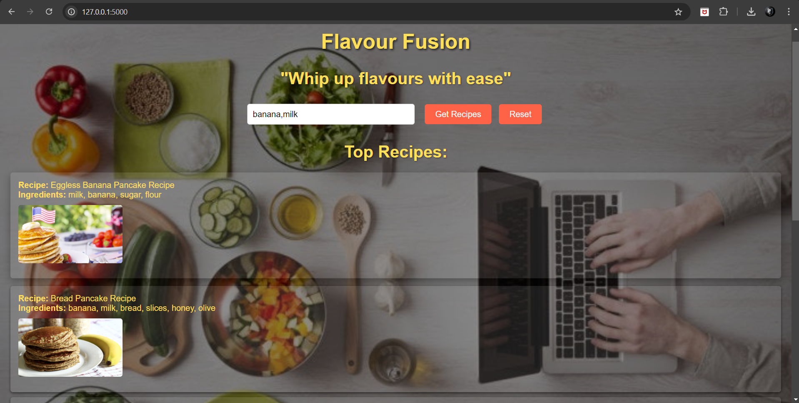

# 🍽️ Recipe Recommendation System

This repository contains the code and resources for a **Recipe Recommendation System**. The system uses a trained machine learning model to suggest recipes based on user input. The project includes data scraping, preprocessing, model training, and a Flask API to serve recipe recommendations.

## 🌐 Website Preview




## 📁 Project Structure

- **recipe-recommendation-api/**
  - **api/**
    - `app.py`                   # 🖥️ Main Flask application
    - `route.py`                 # 🔄 API route definitions
    - `requirements.txt`         # 📦 Python dependencies
    - `testapi.py`               # Testing API
  - **data/**
    - **raw/**
      - `recipes_raw.csv`       # 📊 Raw recipe data
      - `recipes_raw(without hindi).csv`  # 📊 Raw data (excluding Hindi text)
    - **processed/**
      - `recipes_processed.csv`  # 🧹 Preprocessed recipe data
  - **models/**
    - `train_model.ipynb`       # 📓 Model training notebook
    - `recipe_recommendation_model.pkl`  # 🤖 Trained recommendation model
  - **scraping/**
    - `scrape_recipes.ipynb`    # 🍴 Web scraping notebook for collecting recipes
  - **static/**
    - **images/**
      - `[background image]`     # 🖼️ Background image for the website
  - **templates/**
    - `index.html`               # 🌐 Main HTML file for the web interface
  - `README.md`                  # 📖 Project overview and instructions


## 🌟 Project Overview

The **Recipe Recommendation System** allows users to get recipe recommendations based on the ingredients they provide. The project is structured as follows:

- **📊 Data Collection**: Recipes are scraped from the web using the script in the `scraping/` folder. This script collects recipe data, including ingredients, preparation methods, and images from multiple sources, saving them in CSV format for further processing.
  
- **🧹 Data Preprocessing**: Raw recipe data is cleaned and processed to generate the `recipes_processed.csv` file. This involves cleaning ingredient lists, removing duplicates, and converting the data into a format suitable for machine learning, with ingredient vectors created for each recipe.

- **🤖 Model Training**: A machine learning model is trained using the preprocessed data and saved as `recipe_recommendation_model.pkl`. The model uses cosine similarity to recommend recipes based on ingredient vectors, ensuring relevant and personalized recommendations for the user.

- **🖥️ API**: A Flask-based API serves the recommendations, with routes defined in `route.py` and served via `app.py`. The API accepts user input (a list of ingredients) and returns a list of recommended recipes. It processes the input to generate a vector representation and calculates similarity scores to find matching recipes.

- **🌐 Web Interface**: The API is connected to a simple web interface (`index.html`), where users can input ingredients and get recipe recommendations. The web interface allows for easy interaction with the recommendation system, displaying recipe suggestions.


## 🚀 Getting Started

### 🛠️ Prerequisites

Ensure you have Python 3.x installed on your system. You will also need to install the required Python libraries listed in `requirements.txt`.

### ⚙️ Installation

1. Clone the repository:
    ```bash
    git clone https://github.com/Vaishnaviii03/recipe-recommendation-api.git
    ```

2. Navigate to the project directory:
    ```bash
    cd recipe-recommendation-api
    ```

3. Install dependencies:
    ```bash
    pip install -r api/requirements.txt
    ```

### ▶️ Running the Project

1. **Start the Flask API**:
    ```bash
    cd api
    python app.py
    ```

2. **Access the Web Interface**: Open a browser and go to `http://127.0.0.1:5000/`. You can input your ingredients, and the system will return recipe recommendations.

### 🧠 Model Training

To train or retrain the recommendation model:

1. Open `models/train_model.ipynb` and run all cells to train the model using the preprocessed data (`recipes_processed.csv`).
2. The trained model will be saved as `recipe_recommendation_model.pkl` in the `models` directory.

### 🍴 Scraping Recipes

To scrape new recipes, run the notebook `scraping/scrape_recipes.ipynb`. This will gather recipe data from the specified sources and save it to the `data/raw` folder.

## 🤝 Contributing

Feel free to submit issues or pull requests if you have suggestions for improving the system or adding new features.

## 📜 License

This project is licensed under the [MIT License](LICENSE).
